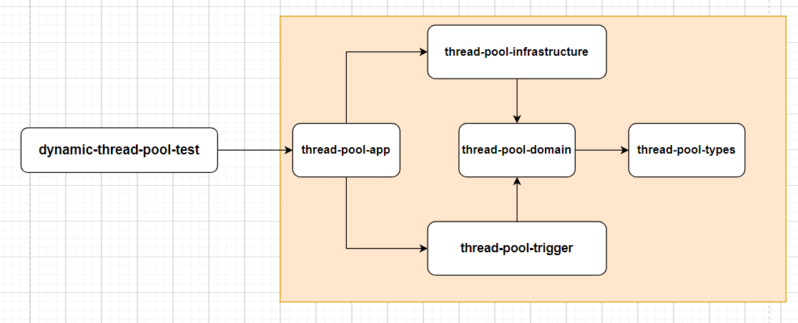
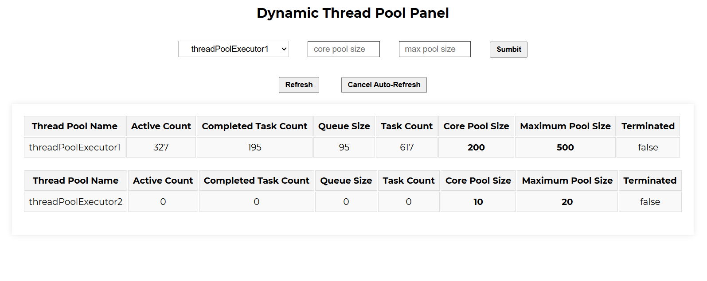

# Dynamic Thread Pool

## Description

**dynamic_thread_pool** is a visual dynamic thread pool component. It allows users to observe the operation of the thread pool in a visual form and adjust the configuration information of the thread pool.

## Features

- Visual representation of thread pool operations.
- Ability to adjust thread pool configuration information.
- Real-time updates on thread pool status.

## Structure

This project is built based on the idea of domain-driven design (DDD)

## Usage

To use the `dynamic_thread_pool` component, follow these steps:

1. Open the visualization page (`html`) located under the `resources/static` directory.
2. The page will display the current project's thread pool operation status.
3. You can view specific information about the thread pool and modify its configuration on the page.

## Contributions and License

- Contributions: Issues and suggestions are welcome, as are code contributions.
- License: Distributed under the MIT License, see the LICENSE file for details.